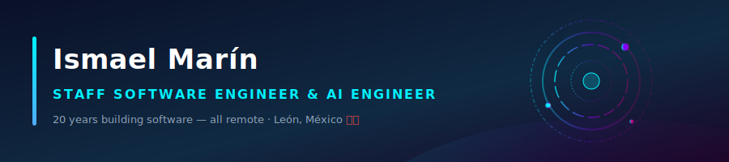
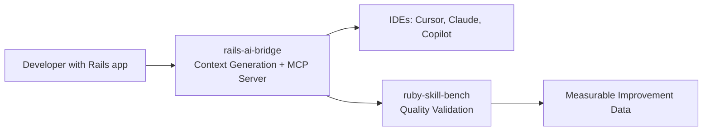

> I build Rails AI tooling that reduces token costs by 15-20% and improves code quality consistency. Author of rails-ai-bridge (2,000+ downloads) and ruby-skill-bench (500+ downloads).

---

## 🚀 About me

I build AI context infrastructure for Rails teams. My tools help developers give AI assistants the right information about their Rails applications, reducing token waste and improving code quality.

* **rails-ai-bridge:** Zero-configuration MCP server that generates context files (CLAUDE.md, .cursor/rules, etc.) and provides live introspection tools. 2,000+ downloads.
* **ruby-skill-bench:** Evaluation engine that measures whether AI context actually improves output. 500+ downloads.
* **Proven results:** 40-200% performance improvement, 15-20% token savings in production Rails applications.

I'm available for consulting engagements helping Rails teams adopt AI tooling effectively.

---

## 🧠 How It Works

### ⚙️ Core Repositories

#### ⚡ [rails-ai-bridge](https://github.com/igmarin/rails-ai-bridge) (Flagship — AI Context Infrastructure for Rails)

A zero-configuration MCP server providing instant, read-only system introspection tools (routes, models, database schemas, active jobs) directly to AI assistants. Generates context files for multiple AI clients (Cursor, Claude, Copilot, Windsurf, RubyMine, Codex CLI).

* **2,000+ downloads** on RubyGems
* **94.49% test coverage** with 1,745 specs
* **Multi-format output:** CLAUDE.md, .cursor/rules, AGENTS.md, GEMINI.md
* **Semantic analysis:** Integrated rubydex for code graph context
* **MCP Server:** 11 live introspection tools for AI assistants
* **Token savings:** ~15-20% reduction via smart context presets

#### 📊 [ruby-skill-bench](https://github.com/igmarin/ruby-skill-bench) (Evaluation Engine)

High-fidelity evaluation engine for benchmarking AI agent skills. Measures the "ROI of Context" by comparing baseline vs. skill-enhanced agent runs with 100% reproducibility via isolated Git sandboxes.

* **500+ downloads** on RubyGems
* **Multi-provider support:** OpenAI, Anthropic, Gemini, DeepSeek, Groq, Ollama, and more
* **Blind judging:** Evaluates across Correctness, Quality, Test Coverage dimensions
* **Process gates:** Validates TDD adherence and workflow discipline

#### 📦 Skill Packs (Content Assets)

* **[rails-agent-skills](https://github.com/igmarin/rails-agent-skills):** 28 Rails-specific skills and 9 workflow templates (tdd, review, setup, quality, engine, bug-fix, graphql, migration, background-job).
* **[ruby-core-skills](https://github.com/igmarin/ruby-core-skills):** 15 foundational Ruby skills for refactoring, security, and test planning.
* **[hanakai-yaku](https://github.com/igmarin/hanakai-yaku):** Experimental Hanami skills (35 skills + 10 agents) — used to validate skill format portability, not actively maintained as a product.

#### 🗃️ [agent-mcp-runtime](https://github.com/igmarin/agent-mcp-runtime) (Archived — Learning Project)

Safe Rust CLI for MCP runtime management. Served as a learning project and prototype. Registry resolution logic has been ported to rails-ai-bridge. This repository is archived.

---

## 🛠️ Technical Stack

| Core Frameworks                                                                                                | AI Engineering                                                                                                 | Agentic Tools                                                                                       | System Architecture                                                                     | Systems & Infra                                                                                               |
| :--------------------------------------------------------------------------------------------------------------| :-------------------------------------------------------------------------------------------------------------| :----------------------------------------------------------------------------------------------------| :----------------------------------------------------------------------------------------| :--------------------------------------------------------------------------------------------------------------|
|  |                                 |  |                  |  |
|                   |  |                    |                |              |
|                   |       |              |  |            |
|                                                                                                                |                                                                                                                |                                                                                                      |                                                                                          |  |

---

## 📈 Proven Production Impact

* **Dealerware (Software Technical Lead | May 2022 — April 2026):** Originally joined as a contractor via 3Pillar Global, hired directly and promoted from Mid-level to Senior, and subsequently to Software Technical Lead due to high performance. Directed cross-functional distributed squads across 20+ production codebases while maintaining exceptional individual contributor velocity (370+ merged PRs) on frameworks handling 10,000+ hourly transactions. Led a zero-downtime search infrastructure overhaul migrating from Elasticsearch to OpenSearch, and elevated core system test coverage from 55% to 80% via AI-assisted edge case discovery.
* **3Pillar Global (Lead Software Engineer):** Modernized legacy enterprise monolithic codebases by enforcing structured Domain-Driven Design (DDD) principles and Service Objects, and designed a comprehensive end-to-end multi-region i18n framework from scratch.
* **MagmaLabs (Senior Engineering Manager):** Guided company-wide high-throughput e-commerce integrations, scaling progressive checkout workflows, advanced subscription layers, and complex multi-region payment gateways across the Spree and Solidus ecosystems.

---

## 🤝 Let's Collaborate

I help Rails teams adopt AI tooling effectively through consulting and open-source tools.

* 💼 **Consulting:** AI context audits, rails-ai-bridge implementation, skill pack customization, and eval-driven quality improvement.
* 💬 **Open source:** Discuss rails-ai-bridge or ruby-skill-bench via GitHub issues or discussions.
* 📧 **Contact:** [LinkedIn](https://linkedin.com/in/ismaelmarin) or [ismael.marin@gmail.com](mailto:ismael.marin@gmail.com)

