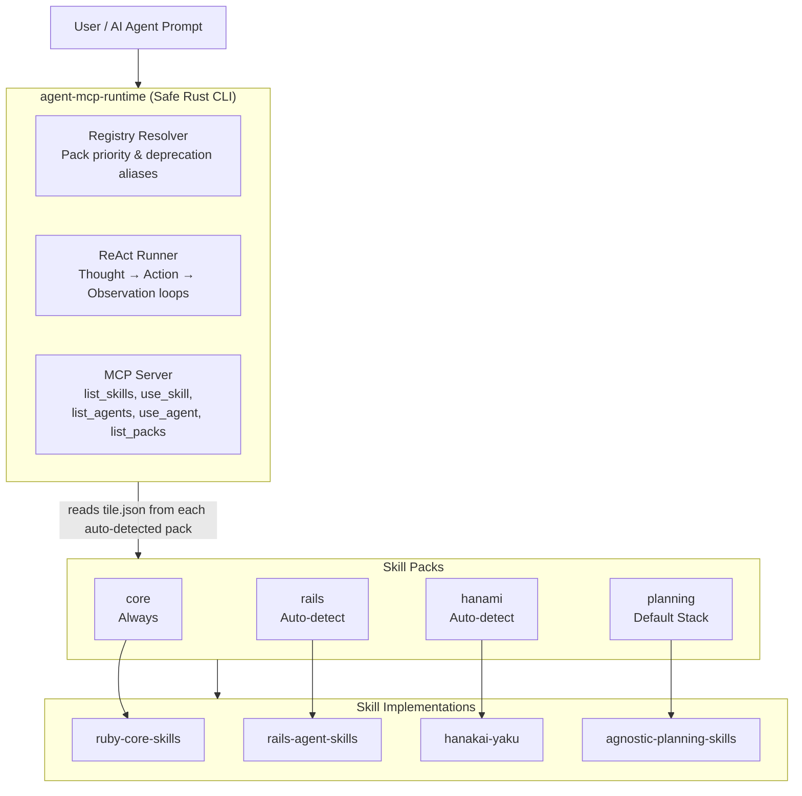

# Ismael G. Marín Cabrera

## Staff Software Engineer & AI Engineer

### 20 Years of Backend Expertise Architecture | Building High-Performance Agentic AI Runtimes & MCP Tools (Ruby, Python, Rust)

> Moving AI Agents from "Vibe Coding" to Deterministic Production Realities. I build the runtimes, tools, and evaluation frameworks that give LLMs architectural discipline.

---

## 🚀 About me

I am a product-led engineer who has spent two decades scaling mission-critical distributed backend SaaS systems handling **10,000+ transactions per hour**. Today, I bridge that foundational experience directly into **AI Engineering**—not just writing prompts, but engineering multi-step runtimes, Model Context Protocol (MCP) servers, and high-fidelity empirical validation loops that make coding agents production-ready.

* **The Problem:** Probabilistic LLMs write code based on "vibes," leading to context token waste, architectural boundary breakages, and silent regressions.
* **The Solution:** Deterministic grounding. I build secure, isolated execution runtimes, structural introspection tools, and explicit markdown hard-gates that force AI agents to adhere to TDD and DDD discipline before mutating a single line of production code.

---

## 🧠 The AI Skill Ecosystem — Architectural Overview

I am actively designing and maintaining a modular, multi-language agent framework built to scale framework-specific context awareness and inject strict process discipline into autonomous code-generation loops.

### ⚙️ Core Repositories & Components

#### ⚡ [agent-mcp-runtime](https://github.com/igmarin/agent-mcp-runtime) (The Flagship Safe Rust CLI Engine)

An agentic framework runtime built entirely in safe Rust to compose atomic skills from multiple separate packs via the Model Context Protocol.

* **Strict Compile-Time Safety:** Zero unsafe code permitted (`#[deny(unsafe_code)]`) with rigid workspace linting gates.
* **Asynchronous ReAct Runner:** Orchestrates multi-step reasoning and action loops using customizable LLM providers via a factory service (`LlmProviderFactory`).
* **Model Context Protocol (MCP) Client:** Integrates external tools by spawning long-running subprocesses and exchanging JSON-RPC 2.0 messages over standard I/O streams with isolated runners.
* **Dynamic Context Merging:** Automatically scans project roots (e.g., parses a `Gemfile`), auto-detects the active framework (Rails or Hanami), hot-loads matching local/remote skill packs, and maps outputs transparently into database, routing, or architectural model context tiers.
* **Mockable Skill Pack Caching:** Employs git resolvers (`SkillSourceResolver`) backed by a mockable `GitRunner` interface for fully offline, blazingly fast execution testing and safe error cleanup.
* **TDD Frontmatter Parser:** Parses Markdown frontmatter to seamlessly extract execution metadata and constraints for agent skills/tools.

#### 📦 Specialized Skill Packs (Independently validated on Tessel with scores >93%)

* **[rails-agent-skills](https://github.com/igmarin/rails-agent-skills):** Rails-specific development workflows compiling 43 available skills and 9 specialized autonomous agents (*tdd, review, setup, quality, engine, bug-fix, graphql, migration, background-job*).
* **[hanakai-yaku](https://github.com/igmarin/hanakai-yaku):** Dedicated agentic development skill library containing 50 available skills optimized explicitly for the Hanami 2.x, `dry-rb`, and Repository Object Mapper (ROM) ecosystem.
* **[ruby-core-skills](https://github.com/igmarin/ruby-core-skills):** Base orchestration layer providing 15 atomic skills covering foundational refactoring, code formatting, security audits, and automated test planning discipline.
* **[agnostic-planning-skills](https://github.com/igmarin/agnostic-planning-skills):** Language-agnostic project planning engine delivering 10 unique skills across 4 specialized management roles (*delivery-lead, product-owner, project-manager, tech-lead*).

#### 🛠️ Tooling & Context Layer

* **[ruby-skill-bench](https://github.com/igmarin/ruby-skill-bench):** An empirical evaluation engine measuring the direct "ROI of Context" for AI skills. Automatically orchestrates secure, isolated Git-based sandboxes ensuring 100% execution reproducibility and runs multi-dimensional LLM blind judging (*Correctness, Quality, Test Coverage*) to eliminate regressions.
* **[rails-ai-bridge](https://github.com/igmarin/rails-ai-bridge):** A zero-configuration MCP server providing instant, read-only system introspection tools (routes, models, database schemas, active jobs) directly to AI assistants. Reduces token overhead by ~15% via smart presets while accelerating response precision.

---

## 🛠️ Deep Technical Stack

| Core Frameworks                                                                                                | AI Engineering                                                                                                 | Agentic Tools                                                                                       | System Architecture                                                                     | Systems & Infra                                                                                               |
| :--------------------------------------------------------------------------------------------------------------| :-------------------------------------------------------------------------------------------------------------| :----------------------------------------------------------------------------------------------------| :----------------------------------------------------------------------------------------| :--------------------------------------------------------------------------------------------------------------|
|  |                                 |  |                  |  |
|                   |                                   |                    |                |              |
|             |  |                                |  |            |
|                   |       |              |        |  |

---

## 📈 Proven Production Impact

* **Dealerware (Software Technical Lead):** Directed cross-functional distributed squads across 20+ production codebases. Maintained exceptional individual contributor velocity (370+ merged PRs) on frameworks handling 10,000+ hourly transactions. Led a zero-downtime search infrastructure overhaul migrating from Elasticsearch to OpenSearch, and elevated core system test coverage from 55% to 80% via AI-assisted edge case discovery.
* **3Pillar Global (Lead Software Engineer):** Modernized legacy enterprise monolithic codebases by enforcing structured Domain-Driven Design (DDD) principles and Service Objects, and designed a comprehensive end-to-end multi-region i18n framework from scratch.
* **MagmaLabs (Senior Engineering Manager):** Guided company-wide high-throughput e-commerce integrations, scaling progressive checkout workflows, advanced subscription layers, and complex multi-region payment gateways across the Spree and Solidus ecosystems.

---

## 🤝 Let's Collaborate

I am actively open to **Senior Software Engineer (Ruby/Rust)** or **AI Engineering** roles (Remote, Americas or EMEA) where technical precision, structural code design, and robust automated workflows intersect.

* 💬 **Want to discuss agentic runtime internals or MCP tools?** Open an issue or a discussion thread directly in [agent-mcp-runtime](https://github.com/igmarin/agent-mcp-runtime).
* 💼 **Looking for a disciplined engineer to scale your backend platform or operationalize secure AI infrastructure?** Let's connect via [LinkedIn](https://linkedin.com/in/ismaelmarin) or reach out directly at [ismael.marin@gmail.com](mailto:ismael.marin@gmail.com).

