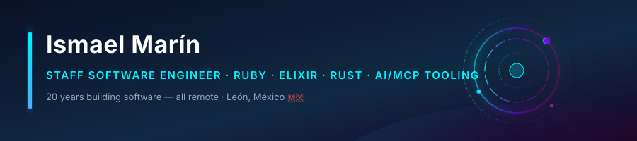
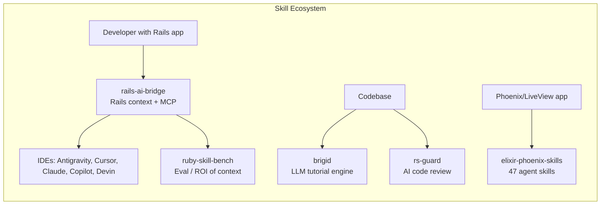

> Staff Software Engineer with 20 years of remote backend experience. I ship production AI tooling across three runtimes — **Ruby (Rails)**, **Elixir/Phoenix**, and **Rust** — using MCP, ReAct, and disciplined TDD/DDD to make AI actually useful in production codebases.

---

## 🚀 About me

I build AI tooling and high-throughput backend systems across **Ruby (Rails)**, **Elixir/Phoenix**, and **Rust**. My focus is making AI useful, safe, and measurable in production: MCP servers, context bridges, evaluation sandboxes, and memory-safe CLIs.

### By language

- **Ruby**
  - [`rails-ai-bridge`](https://github.com/igmarin/rails-ai-bridge) — Ruby. Zero-config MCP server + context files for Rails. **5,846** RubyGems downloads, **94.49%** test coverage.
  - [`ruby-skill-bench`](https://github.com/igmarin/ruby-skill-bench) — Ruby. Evaluation engine that measures the ROI of AI context. **1,734** RubyGems downloads, multi-provider, blind LLM judging.
  - [`rails-agent-skills`](https://github.com/igmarin/rails-agent-skills) — Ruby. 28 Rails-specific skills + 9 workflow templates.
  - [`ruby-core-skills`](https://github.com/igmarin/rails-agent-skills) — framework-agnostic foundations for TDD, refactoring, code review, security review, DDD, inline documentation, and common Ruby design patterns.
- **Rust**
  - [`brigid`](https://github.com/igmarin/brigid) — crate downloads; turns codebases into LLM-generated tutorials
  - [`rs-guard`](https://github.com/nebulaideas/rs-guard) — multi-provider AI code-review CLI
- **Elixir**
  - [`elixir-phoenix-skills`](https://github.com/igmarin/elixir-phoenix-skills) — **47** agent skills for idiomatic Phoenix/LiveView/Ecto

### Why this matters

- **Polyglot depth:** real, shipped code in three different runtimes, not toy repos.
- **AI/tooling credibility:** MCP servers, eval frameworks, and safe Rust CLIs — not "vibe coding".

---

## 🧠 How It Works

```mermaid
flowchart LR
    subgraph "Skill Ecosystem"
      Rails[Developer with Rails app] --> Bridge[rails-ai-bridge<br/>Rails context + MCP]
      Bridge --> IDEs[IDEs: Antigravity, Cursor, Claude, Copilot, Devin]
      Bridge --> Bench[ruby-skill-bench<br/>Eval / ROI of context]
      Codebase[Codebase] --> Brigid[brigid<br/>LLM tutorial engine]
      Codebase --> Guard[rs-guard<br/>AI code review]
      Phoenix[Phoenix/LiveView app] --> Skills[elixir-phoenix-skills<br/>47 agent skills]
    end
```

## 🛠️ Technical Stack

| Ruby / Rails | Elixir / Phoenix | Rust | AI Engineering | Systems & Architecture |
| :----------- | :--------------- | :--- | :------------- | :--------------------- |
|  |  |  |  |  |
|  |  |  |  |  |
| | | |  |  |
| | | |  |  |
| | | |  |  |

---

## 📈 Proven Production Impact

- **Dealerware (Software Technical Lead | May 2022 — April 2026):** Originally joined as a contractor via 3Pillar Global, hired directly and promoted from Mid-level to Senior, and subsequently to Software Technical Lead due to high performance. Directed cross-functional distributed squads across 20+ production codebases while maintaining exceptional individual contributor velocity (370+ merged PRs) on frameworks handling 10,000+ hourly transactions. Led a zero-downtime search infrastructure overhaul migrating from Elasticsearch to OpenSearch, and elevated core system test coverage from 55% to 80% via AI-assisted edge case discovery.
- **3Pillar Global (Lead Software Engineer):** Modernized legacy enterprise monolithic codebases by enforcing structured Domain-Driven Design (DDD) principles and Service Objects, and designed a comprehensive end-to-end multi-region i18n framework from scratch.
- **MagmaLabs (Senior Engineering Manager):** Guided company-wide high-throughput e-commerce integrations, scaling progressive checkout workflows, advanced subscription layers, and complex multi-region payment gateways across the Spree and Solidus ecosystems.

---

## 🤝 Let's Collaborate

I help engineering teams adopt AI tooling across Ruby, Elixir, and Rust through consulting and open-source tools.

- 💼 **Consulting:** AI context audits, MCP server implementation, skill pack customization, and eval-driven quality improvement.
- 💬 **Open source:** Discuss rails-ai-bridge, ruby-skill-bench, brigid, or elixir-phoenix-skills via GitHub issues or discussions.
- 📧 **Contact:** [LinkedIn](https://linkedin.com/in/ismaelmarin) or [ismael.marin@gmail.com](mailto:ismael.marin@gmail.com)

