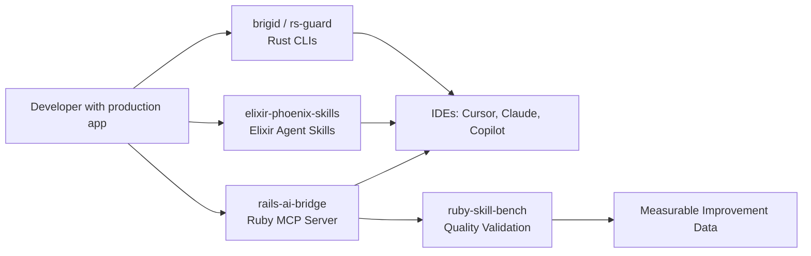

# Ismael Marín — Staff Software Engineer | Ruby · Elixir · Rust | AI/MCP Tooling

> Staff Software Engineer with 20 years of remote backend experience. I ship production AI tooling across three runtimes — **Ruby (Rails), Elixir/Phoenix, and Rust** — using MCP, ReAct, and disciplined TDD/DDD to make AI actually useful in production codebases.

---

## 🚀 About me

I build AI tooling and high-throughput backend systems across **Ruby (Rails), Elixir/Phoenix, and Rust**. My focus is making AI useful, safe, and measurable in production: MCP servers, context bridges, evaluation sandboxes, and memory-safe CLIs.

* **Production results:** 40-200% performance improvement, 15-20% token savings in real-world applications.
* **Remote-first:** 20 years shipping software from León, México 🇲🇽.
* **Available for:** Staff IC, platform/architecture, and consulting engagements on AI/MCP infrastructure.

---

## 🌐 By Language

### 🔴 Ruby

* **[rails-ai-bridge](https://github.com/igmarin/rails-ai-bridge)** — 5,846 RubyGems downloads. Zero-config MCP server that exposes Rails apps to AI assistants.
* **[ruby-skill-bench](https://github.com/igmarin/ruby-skill-bench)** — 1,734 RubyGems downloads. Evaluation engine that measures the ROI of context for AI agents.
* **[rails-agent-skills](https://github.com/igmarin/rails-agent-skills)** — 22 GitHub stars. 28 Rails skills + 9 workflow templates for agentic development.

### ⚫ Rust

* **[brigid](https://github.com/igmarin/brigid)** — 169 `brigid-core` crate downloads. LLM-powered CLI that turns any codebase into a beginner-friendly tutorial.
* **[rs-guard](https://github.com/nebulaideas/rs-guard)** — 242 `rs-guard` crate downloads. Multi-provider AI code-review CLI (DeepSeek, Qwen, OpenRouter, and more).

### 🟣 Elixir

* **[elixir-phoenix-skills](https://github.com/igmarin/elixir-phoenix-skills)** — 47 agent skills for idiomatic Phoenix, LiveView, and Ecto development.

---

## 🧠 How It Works

```mermaid
flowchart LR
    Developer[Developer with production app] --> Ruby[rails-ai-bridge<br/>Ruby MCP Server]
    Developer --> Elixir[elixir-phoenix-skills<br/>Elixir Agent Skills]
    Developer --> Rust[brigid / rs-guard<br/>Rust CLIs]
    Ruby --> IDEs[IDEs: Cursor, Claude, Copilot]
    Elixir --> IDEs
    Rust --> IDEs
    Ruby --> Bench[ruby-skill-bench<br/>Quality Validation]
    Bench --> Results[Measurable Improvement Data]
```

### ⚙️ Core Repositories

#### ⚡ [rails-ai-bridge](https://github.com/igmarin/rails-ai-bridge) (Flagship — Ruby AI Context Infrastructure)

A zero-configuration MCP server providing instant, read-only system introspection tools (routes, models, database schemas, active jobs) directly to AI assistants. Generates context files for multiple AI clients (Cursor, Claude, Copilot, Windsurf, RubyMine, Codex CLI).

* **5,846 downloads** on RubyGems
* **94.49% test coverage** with 1,745 specs
* **Multi-format output:** CLAUDE.md, .cursor/rules, AGENTS.md, GEMINI.md
* **Semantic analysis:** Integrated rubydex for code graph context
* **MCP Server:** 11 live introspection tools for AI assistants
* **Token savings:** ~15-20% reduction via smart context presets

#### 📊 [ruby-skill-bench](https://github.com/igmarin/ruby-skill-bench) (Evaluation Engine)

High-fidelity evaluation engine for benchmarking AI agent skills. Measures the "ROI of Context" by comparing baseline vs. skill-enhanced agent runs with 100% reproducibility via isolated Git sandboxes.

* **1,734 downloads** on RubyGems
* **Multi-provider support:** OpenAI, Anthropic, Gemini, DeepSeek, Groq, Ollama, and more
* **Blind judging:** Evaluates across Correctness, Quality, Test Coverage dimensions
* **Process gates:** Validates TDD adherence and workflow discipline

#### ⚫ [brigid](https://github.com/igmarin/brigid) (Rust — LLM Tutorial Engine)

A memory-safe Rust CLI that ingests any codebase and generates beginner-friendly, LLM-driven tutorials. Powers the `brigid-core` crate.

* **169 downloads** for `brigid-core` on crates.io
* **Safe systems Rust:** memory-safe parsing and codegen
* **Multi-LLM support:** pluggable providers for tutorial generation

#### 🛡️ [rs-guard](https://github.com/nebulaideas/rs-guard) (Rust — Multi-Provider AI Code Review)

A fast, multi-provider AI code-review CLI published under the `nebulaideas` org. Supports DeepSeek, Qwen, OpenRouter, and others.

* **242 downloads** for `rs-guard` on crates.io
* **Rust CLI:** fast, portable, safe code-review automation
* **Multi-provider:** switch providers without changing workflow

#### 🟣 [elixir-phoenix-skills](https://github.com/igmarin/elixir-phoenix-skills) (Elixir — Agent Skills for Phoenix)

47 agent skills covering idiomatic Phoenix, LiveView, Ecto, and deployment patterns. Designed for Elixir teams that want agentic AI with context that actually fits the ecosystem.

* **47 skills** for Phoenix, LiveView, Ecto, and releases
* **Elixir-first:** patterns that match the BEAM concurrency model

#### 📦 [rails-agent-skills](https://github.com/igmarin/rails-agent-skills) (Skill Pack — 22 stars)

28 Rails-specific skills and 9 workflow templates (tdd, review, setup, quality, engine, bug-fix, graphql, migration, background-job).

* **[ruby-core-skills](https://github.com/igmarin/ruby-core-skills):** 15 foundational Ruby skills for refactoring, security, and test planning.
* **[hanakai-yaku](https://github.com/igmarin/hanakai-yaku):** Experimental Hanami skills (35 skills + 10 agents) — used to validate skill format portability, not actively maintained as a product.

---

## 🛠️ Technical Stack

| Languages & Frameworks                                                                                         | AI Engineering                                                                                                 | Agentic Tools                                                                                       | System Architecture                                                                     | Systems & Infra                                                                                               |
| :--------------------------------------------------------------------------------------------------------------| :-------------------------------------------------------------------------------------------------------------| :----------------------------------------------------------------------------------------------------| :----------------------------------------------------------------------------------------| :--------------------------------------------------------------------------------------------------------------|
|                   |                                 |  |                  |  |
|  |  |                    |                |              |
|             |       |              |  |            |
|                   |                                    |  |  |  |

---

## 📈 Proven Production Impact

* **Dealerware (Software Technical Lead | May 2022 — April 2026):** Originally joined as a contractor via 3Pillar Global, hired directly and promoted from Mid-level to Senior, and subsequently to Software Technical Lead due to high performance. Directed cross-functional distributed squads across 20+ production codebases while maintaining exceptional individual contributor velocity (370+ merged PRs) on frameworks handling 10,000+ hourly transactions. Led a zero-downtime search infrastructure overhaul migrating from Elasticsearch to OpenSearch, and elevated core system test coverage from 55% to 80% via AI-assisted edge case discovery.
* **3Pillar Global (Lead Software Engineer):** Modernized legacy enterprise monolithic codebases by enforcing structured Domain-Driven Design (DDD) principles and Service Objects, and designed a comprehensive end-to-end multi-region i18n framework from scratch.
* **MagmaLabs (Senior Engineering Manager):** Guided company-wide high-throughput e-commerce integrations, scaling progressive checkout workflows, advanced subscription layers, and complex multi-region payment gateways across the Spree and Solidus ecosystems.

---

## 🤝 Let's Collaborate

I help teams adopt AI tooling, build MCP infrastructure, and ship high-throughput backends.

* 💼 **Consulting:** AI context audits, MCP server implementation, skill pack customization, and eval-driven quality improvement.
* 💬 **Open source:** Discuss rails-ai-bridge, brigid, or elixir-phoenix-skills via GitHub issues or discussions.
* 📧 **Contact:** [LinkedIn](https://linkedin.com/in/ismaelmarin) or [ismael.marin@gmail.com](mailto:ismael.marin@gmail.com)

