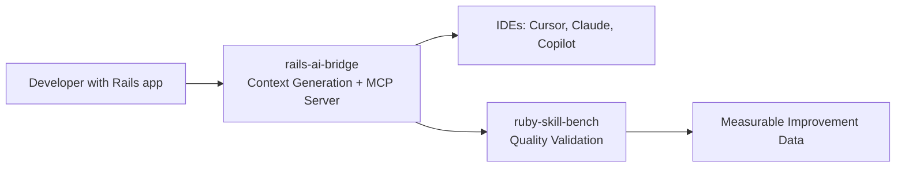

# Plan 3: Update GitHub Bio to Reflect Rails AI Tooling Engineer Positioning

**Status:** Pending
**Priority:** Immediate (same day as Plan 1)
**Estimated effort:** 1-2 hours

## Objective

Rewrite the `igmarin/igmarin` README.md to position as "Rails AI Tooling Engineer" with `rails-ai-bridge` as the flagship, not "AI ecosystem architect" with `agent-mcp-runtime` as the center.

## Changes to README.md

### 1. Update header/title

Change from:
```
STAFF SOFTWARE ENGINEER & AI ENGINEER
```
To:
```
RAILS AI TOOLING ENGINEER
```

Update `header.svg` accordingly.

### 2. Update hero quote (line 10)

Change from:
```
> Moving AI Agents from "Vibe Coding" to Deterministic Production Realities. I build the runtimes, tools, and evaluation frameworks that give LLMs architectural discipline.
```
To:
```
> I build Rails AI tooling that reduces token costs by 15-20% and improves code quality consistency. Author of rails-ai-bridge (2,000+ downloads) and ruby-skill-bench (500+ downloads).
```

### 3. Rewrite "About me" section (lines 14-19)

Replace the current "product-led engineer" narrative with:

```markdown
## 🚀 About me

I build AI context infrastructure for Rails teams. My tools help developers give AI assistants the right information about their Rails applications, reducing token waste and improving code quality.

* **rails-ai-bridge:** Zero-configuration MCP server that generates context files (CLAUDE.md, .cursor/rules, etc.) and provides live introspection tools. 2,000+ downloads.
* **ruby-skill-bench:** Evaluation engine that measures whether AI context actually improves output. 500+ downloads.
* **Proven results:** 40-200% performance improvement, 15-20% token savings in production Rails applications.

I'm available for consulting engagements helping Rails teams adopt AI tooling effectively.
```

### 4. Replace ecosystem diagram (lines 23-59)

The current mermaid diagram centers agent-mcp-runtime. Replace with:



### 5. Reorder "Core Repositories" section (lines 61-85)

Move `rails-ai-bridge` to the top as the flagship. New structure:

**1. rails-ai-bridge (Flagship — AI Context Infrastructure for Rails)**
- 2,000+ downloads on RubyGems
- 94.49% test coverage with 1,745 specs
- Multi-format output: CLAUDE.md, .cursor/rules, AGENTS.md, GEMINI.md
- Semantic analysis: Integrated rubydex for code graph context
- MCP Server: 11 live introspection tools for AI assistants
- Token savings: ~15-20% reduction via smart context presets

**2. ruby-skill-bench (Evaluation Engine)**
- 500+ downloads on RubyGems
- Multi-provider support: OpenAI, Anthropic, Gemini, DeepSeek, Groq, Ollama, and more
- Blind judging: Evaluates across Correctness, Quality, Test Coverage dimensions
- Process gates: Validates TDD adherence and workflow discipline

**3. Skill Packs (Content Assets)**
- **rails-agent-skills:** 28 Rails-specific skills and 9 workflow templates (tdd, review, setup, quality, engine, bug-fix, graphql, migration, background-job).
- **ruby-core-skills:** 15 foundational Ruby skills for refactoring, security, and test planning.
- **hanakai-yaku:** Experimental Hanami skills (35 skills + 10 agents) — used to validate skill format portability, not actively maintained as a product.

**4. agent-mcp-runtime (Archived — Learning Project)**
- Safe Rust CLI for MCP runtime management. Served as a learning project and prototype. Registry resolution logic has been ported to rails-ai-bridge. This repository is archived.

### 6. Update "Let's Collaborate" section (lines 107-112)

Change from agent-mcp-runtime focus to consulting focus:

```markdown
I help Rails teams adopt AI tooling effectively through consulting and open-source tools.

* 💼 **Consulting:** AI context audits, rails-ai-bridge implementation, skill pack customization, and eval-driven quality improvement.
* 💬 **Open source:** Discuss rails-ai-bridge or ruby-skill-bench via GitHub issues or discussions.
* 📧 **Contact:** [LinkedIn](https://linkedin.com/in/ismaelmarin) or [ismael.marin@gmail.com](mailto:ismael.marin@gmail.com)
```

### 7. Simplify tech stack table (lines 88-95)

- **Remove:** LangGraph, Devin, generic "Agentic AI Systems"
- **Keep:** Rails, Ruby, Rust, MCP, Cursor, Claude Code, DeepSeek, TDD/RSpec, DDD, Docker, PostgreSQL, AWS, Cloudflare

### 8. Keep "Proven Production Impact" section (lines 99-103)

This section is strong and validates the consulting angle. No changes needed.

## Success Criteria

- [ ] README positions rails-ai-bridge as flagship
- [ ] Hero quote mentions measurable results (downloads, token savings)
- [ ] Ecosystem diagram is simplified (no agent-mcp-runtime as center)
- [ ] Consulting CTA is present
- [ ] agent-mcp-runtime listed as archived
- [ ] Tech stack table cleaned up
